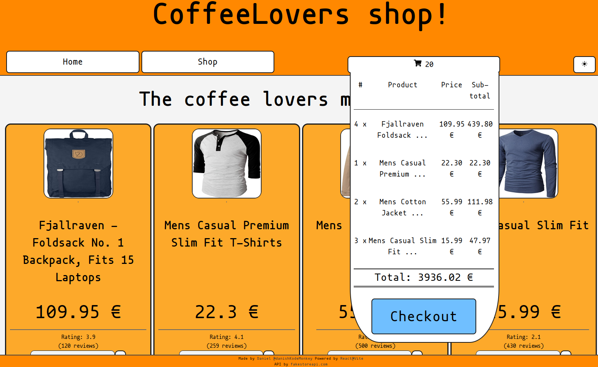
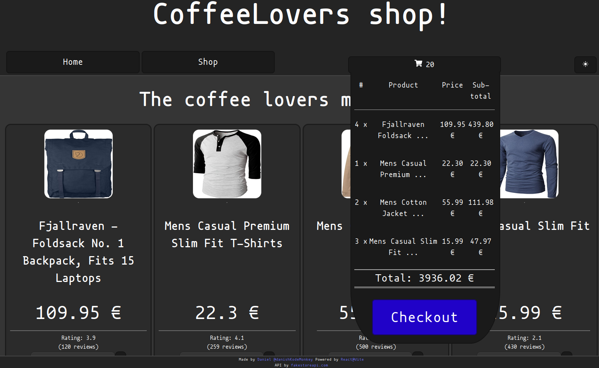

# Odin shopping cart

## A demo of a function cart created using react.

Welcome to the coffee lovers merch shop! Though not really as it's just a prototype project.

It's been a great trip and a immense learning experience to really get deep into the use and utilisation of React

I even went on a bonus tangent and added a dark mode feature!

### What did you learn?

That dark mode features should be thought out and implemented from the start and not towards the end on a hunch.

Jokes aside, the process of developing a react project has introduced me to numerous thoughts and techniques that I'd probably do different than I did this time. A great learning experience that will make future projects even better!

### What's it like?

Have a look!

# Check it out!

[Give it try youself here](https://odin-shopping-cart-149.pages.dev/)
